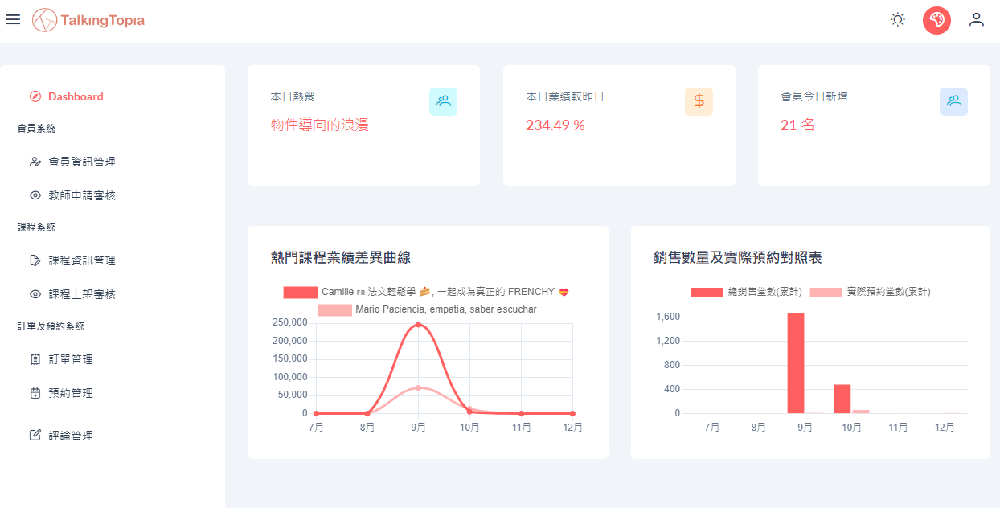
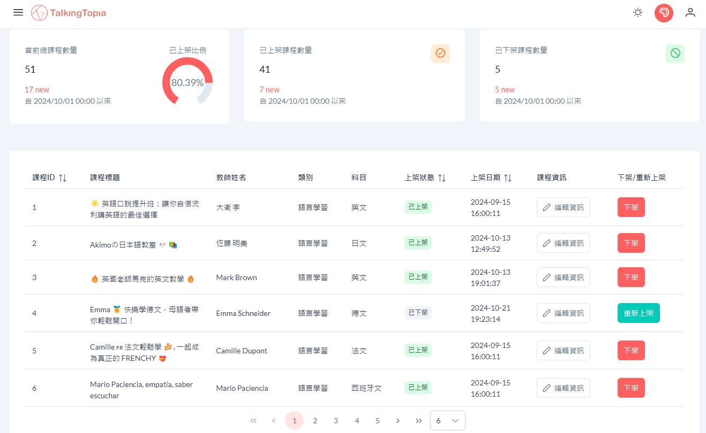

# Talking Topia 後台管理系統

[](https://docs.google.com/presentation/d/1XYwkSV8wAzxgSSdiYePEwL_ryG7Bd-YxK6nZWQ-yzPA/edit?slide=id.g3014e9f0da1_3_75#slide=id.g3014e9f0da1_3_75)
[](https://github.com/hsinhan-h/talking-topia)
---

　

## 專案簡介

**Talking Topia 線上家教平台** 的後台管理系統，供平台管理員進行會員、課程、訂單、預約管理等後台操作。以 **Vue 3 + Vite** 開發，基於 **PrimeVue Sakai** 模板客製化，採前後端分離架構透過 **RESTful API** 與 ASP.NET Core 後端溝通。

---

## 後台技術說明

採 **Composition API** 搭配 **Pinia** 集中管理驗證狀態，透過 **Vue Router Navigation Guard** 從 `localStorage` 驗證 JWT Token 攔截未授權的頁面存取。UI 採用 **PrimeVue 4** 元件庫，搭配 **Tailwind CSS** 與 SCSS。 API 呼叫統一由 **Axios** 發送，端點透過環境變數 `VITE_API_HOST` 集中管理。

---

## 個人負責模組

| 層級 | 模組 |
| ---- | ---- |
| **後台** | 課程資訊管理（課程列表、編輯、下架、重新上架） |
| **後台** | 上架課程審核（審核待審課程、通過／駁回申請） |
| **整合** | Cloudinary 雲端圖床串接（課程圖片即時上傳與編輯） |

---

## 個人負責模組技術細節

### 1. 課程資訊管理


#### 以 Dapper 實作後台課程 CRUD

- **Dapper ORM**：後端採用輕量級 **Dapper** 取代 EF Core，提升大量課程資料的讀取效能。
- **並行資料載入**：頁面掛載時以 `Promise.all` 同時發送七支 API（課程列表＋六組統計數量），避免序列等待，縮短儀表板初始載入時間。
- **表單驗證**：編輯課程彈窗中對表單內容進行前端即時驗證，防止無效資料送出 API。

#### 課程圖片雲端上傳（Cloudinary）

- **Cloudinary API 串接**：串接Cloudinary API來建置雲端圖床，後端回傳圖片 URL 後即時更新前端預覽。
- **多圖管理**：使用 **PrimeVue FileUpload** 元件支援多檔同時選取，並以暫存陣列 `tempCourseImages` 隔離「編輯中狀態」與「已確認狀態」，防止取消操作時污染原始資料。

---

### 2. 上架課程審核

#### 課程審核流程設計

- 三狀態（待審／通過／駁回）審核機制搭配統計卡片即時呈現當月新增量，點擊縮圖即可展開課程預覽，提升審核效率。
- 操作前顯示確認 Dialog 載明教師與課程資訊，審核後立即 re-fetch 確保 UI 與資料庫狀態一致。

---

## 專案架構

### 前端資料夾結構

```text
TalkingTopiaAdmin/
├── src/
│   ├── api/                    # API 路由常數定義
│   ├── assets/                 # 全域樣式（SCSS）、圖片資源
│   │   └── styles/             # 模組級 SCSS（courseManagement / courseApproval）
│   ├── components/             # 可複用 Vue 元件
│   ├── helpers/                # 工具函式（fetchWrapper、imageHelper、retryWithDelay）
│   ├── layout/                 # 頁面框架元件（Topbar、Sidebar、Menu、Footer）
│   ├── router/                 # Vue Router 路由定義＋JWT 路由守衛
│   ├── service/                # API 呼叫封裝（每個功能模組對應一支 Service）
│   │   ├── CourseManagementService.js   # 課程管理 CRUD + Cloudinary 上傳
│   │   ├── CourseApprovalService.js     # 課程審核
│   │   ├── MemberManagementService.js   # 會員管理
│   │   ├── BookingService.js            # 預約管理
│   │   └── ...
│   ├── stores/                 # Pinia 狀態管理（authStore）
│   ├── utilities/              # JWT Token 解析、ApiRequest 封裝
│   └── views/
│       └── pages/              # 各後台功能頁面
│           ├── CourseManagement.vue     # 課程資訊管理
│           ├── CourseApproval.vue       # 課程審核
│           ├── MemberManagement.vue     # 會員管理
│           ├── OrderManagement.vue      # 訂單管理
│           ├── BookingManagement.vue    # 預約管理
│           ├── TutorApproval.vue        # 教師審核
│           └── CommentManagement.vue    # 評論管理
├── .env                        # 本地環境變數（VITE_API_HOST）
├── .env.production             # 正式環境變數
├── vite.config.js              # Vite 建置設定
└── package.json
```

### 前後端分層架構圖

```text
┌─────────────────────────────────┐
│        管理員 / 瀏覽器           │
└──────────────┬──────────────────┘
               │ HTTPS
  ┌────────────▼────────────────┐
  │      TalkingTopiaAdmin      │
  │   Vue 3 + PrimeVue + Vite   │
  │                             │
  │  Router → JWT Guard         │
  │  Views → Service Layer      │
  │  Pinia → authStore          │
  └────────────┬────────────────┘
               │ Axios (RESTful API)
               │ VITE_API_HOST
  ┌────────────▼────────────────┐
  │  TalkingTopia Backend API   │
  │     ASP.NET Core + Dapper   │
  │  CourseManagementApiDapper  │
  │  CloudinaryApi              │
  └──────┬──────────────────────┘
         │
         ├──── SQL Server（課程、會員、訂單）
         └──── Cloudinary（課程圖片雲端儲存）
```

---

### 外部服務整合

| 服務 | 用途 | 設定鍵 |
| ---- | ---- | ------ |
| **ASP.NET Core API** | 後端 RESTful API（Dapper ORM） | `VITE_API_HOST` |
| **Cloudinary** | 課程圖片雲端上傳與儲存 | 由後端 API 統一管理金鑰 |
| **Azure Static Web Apps** | 前端 CI/CD 自動化部署 | `.github/workflows` |

---

## 技術棧

| 類別 | 技術 |
| ---- | ---- |
| **框架** | Vue 3、Vite 5 |
| **UI 元件庫** | PrimeVue 4、PrimeIcons、Sakai Template |
| **樣式** | Tailwind CSS 3、SCSS |
| **狀態管理** | Pinia 2 |
| **路由** | Vue Router 4（含 JWT 路由守衛） |
| **HTTP 客戶端** | Axios |
| **圖表** | Chart.js 3 |
| **圖片儲存** | Cloudinary |
| **CI/CD** | Azure Static Web Apps（GitHub Actions） |
| **版控** | Git / GitHub |

---

## 本地執行

```bash
# 安裝依賴
npm install

# 建立環境設定檔
# 複製 .env 並調整 API 位址
VITE_API_HOST=https://localhost:7204

# 啟動開發伺服器
npm run dev

# 建置正式版本
npm run build
```

> 後端 API 需同步啟動（ASP.NET Core，預設 port 7204），並確認 Cloudinary 金鑰已設定於後端環境變數。
